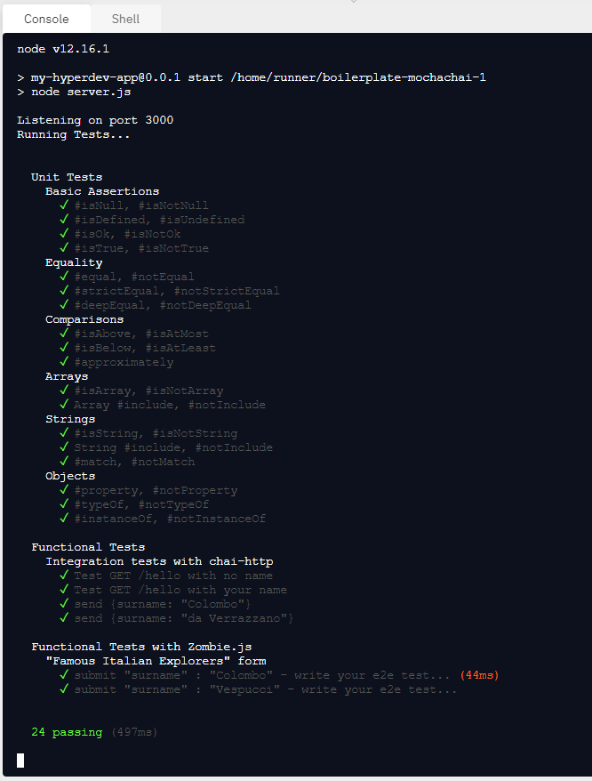

## [Quality Assurance and Testing with Chai](https://www.freecodecamp.org/learn/quality-assurance/quality-assurance-and-testing-with-chai/)

This is the 1 of 3 sections of the <b>Quality Assurance Certification</b> from <a href="https://www.freecodecamp.org/" target="_blank">FreeCodeCamp</a>.

#### About this section

This section focuses on <b>unit and functional testing in NodeJS</b>.
The main library used in this section is chai.

#### Exercises

There are 25 exercises.

The exercises are in the folder "tests"

#### Solutions

All solutions are in individual files for each exercise and can be found in the "SOLVED-EXERCISES" folder.

#### Final Test

